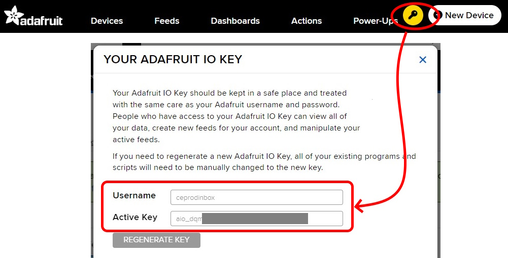
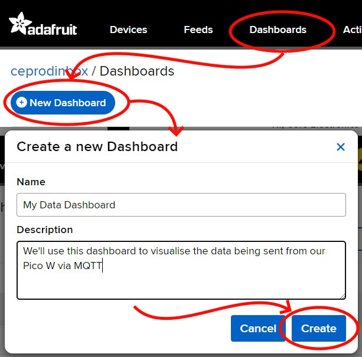
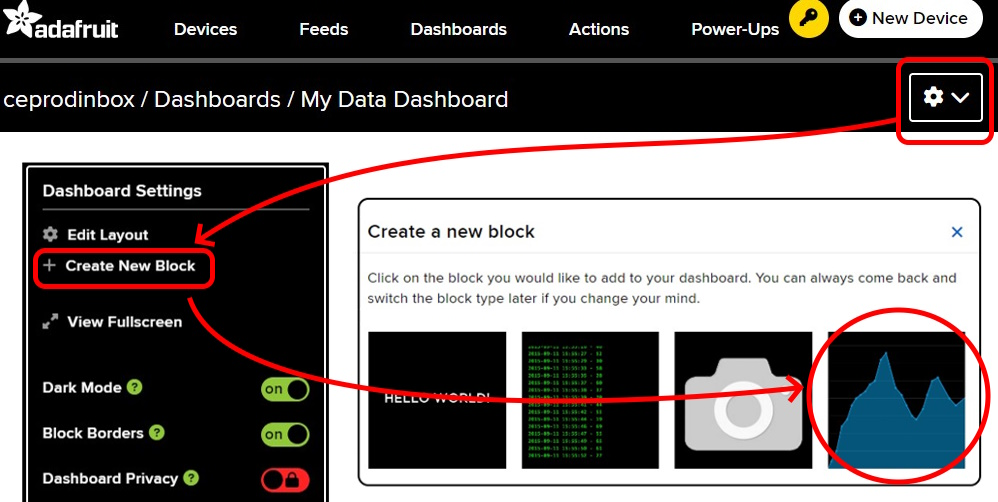
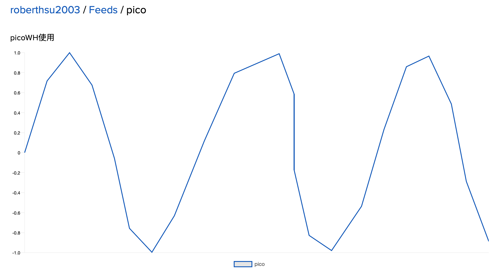

## Adafruit MQTT Service 

### 1.0 [Adafruit_MQTT說明](https://core-electronics.com.au/guides/getting-started-with-mqtt-on-raspberry-pi-pico-w-connect-to-the-internet-of-things/#adafruit-io)

### 2.0 [申請Adafruit io帳號](https://io.adafruit.com/)

### 3.0 取得Adafruit IO Key

要認證 Adafruit IO MQTT 伺服器，我們需要 Adafruit IO 的使用者名稱和金鑰。按一下標題中黃色的 Key 圖示，為您的帳戶產生一個 key。記下密碼匙，我們稍後會用到它。



### 4.0 建立一個Feed
使用 Adafruit IO 的 MQTT 伺服器發佈或訂閱標題，我們首先需要在 Adafruit IO 面板中建立一個「Feed」，這將會成為我們即將發佈訊息的 MQTT 標題！

使用您剛剛建立的帳號，前往「Feeds」並點選「New Feed」。為 Feed 命名，也可選擇描述，然後按一下「建立」。


建立 Feed 後，開啟 Feed 並按一下「Feed Info」，記下 MQTT Topic 的名稱。MQTT Topic 會列在標籤「MQTT by Key」旁 - 記下這一點，我們稍後會用到它。


### 5.0 建立一個控制面版

現在我們有了 feed，最後一個步驟是使用線形圖建立儀表板，以便將資料視覺化。移至「儀表板」，然後按一下「新增儀表板」。



我們可以進入新建立的儀表板，按一下齒輪圖示，按一下「新增區塊」，然後選擇直線圖區塊類型，即可新增直線圖。



我們需要告訴折線圖可視化來自 MQTT 主題的資料，因此在「連接饋送」對話方塊中選擇您之前建立的饋送，然後按一下「下一步」。我們也想要即時檢視資料，因此在區塊設定對話框中，將「顯示歷史」設為「即時（無歷史）」，最後按一下「建立區塊」。注意： 所有其他區塊設定保持預設值即可。


Dashboard 現在應該會顯示空白的圖表。我們現在可以從 Pico W 發佈一些資料，並在 Adafruit IO 上即時觀看！

### 6.0 pico_w直接發佈

```python
"""
A simple example that connects to the Adafruit IO MQTT server
and publishes values that represent a sine wave
"""

import network
import time
from math import sin
from umqtt.simple import MQTTClient

# Fill in your WiFi network name (ssid) and password here:
wifi_ssid = ""
wifi_password = ""

# Connect to WiFi
wlan = network.WLAN(network.STA_IF)
wlan.active(True)
wlan.connect(wifi_ssid, wifi_password)
while wlan.isconnected() == False:
    print('Waiting for connection...')
    time.sleep(1)
print("Connected to WiFi")

# Fill in your Adafruit IO Authentication and Feed MQTT Topic details
mqtt_host = "io.adafruit.com"
mqtt_username = ""  # Your Adafruit IO username
mqtt_password = ""  # Adafruit IO Key
mqtt_publish_topic = ""  # The MQTT topic for your Adafruit IO Feed,使用FeedInfo內產生的key

# Enter a random ID for this MQTT Client
# It needs to be globally unique across all of Adafruit IO.
mqtt_client_id = "somethingreallyrandomandunique123"

# Initialize our MQTTClient and connect to the MQTT server
mqtt_client = MQTTClient(
        client_id=mqtt_client_id,
        server=mqtt_host,
        user=mqtt_username,
        password=mqtt_password)

mqtt_client.connect()

# Publish a data point to the Adafruit IO MQTT server every 3 seconds
# Note: Adafruit IO has rate limits in place, every 3 seconds is frequent
#  enough to see data in realtime without exceeding the rate limit.
counter = 0
try:
    while True:
        # Generate some dummy data that changes every loop
        sine = sin(counter)
        counter += .8
        
        # Publish the data to the topic!
        print(f'Publish {sine:.2f}')
        mqtt_client.publish(mqtt_publish_topic, str(sine))
        
        # Delay a bit to avoid hitting the rate limit
        time.sleep(3)
except Exception as e:
    print(f'Failed to publish message: {e}')
finally:
    mqtt_client.disconnect()
```



