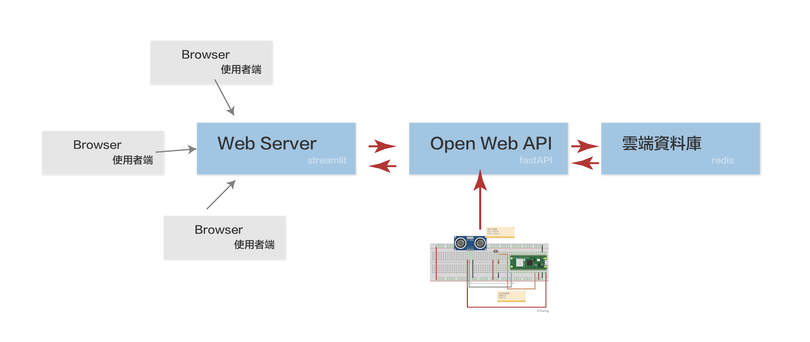
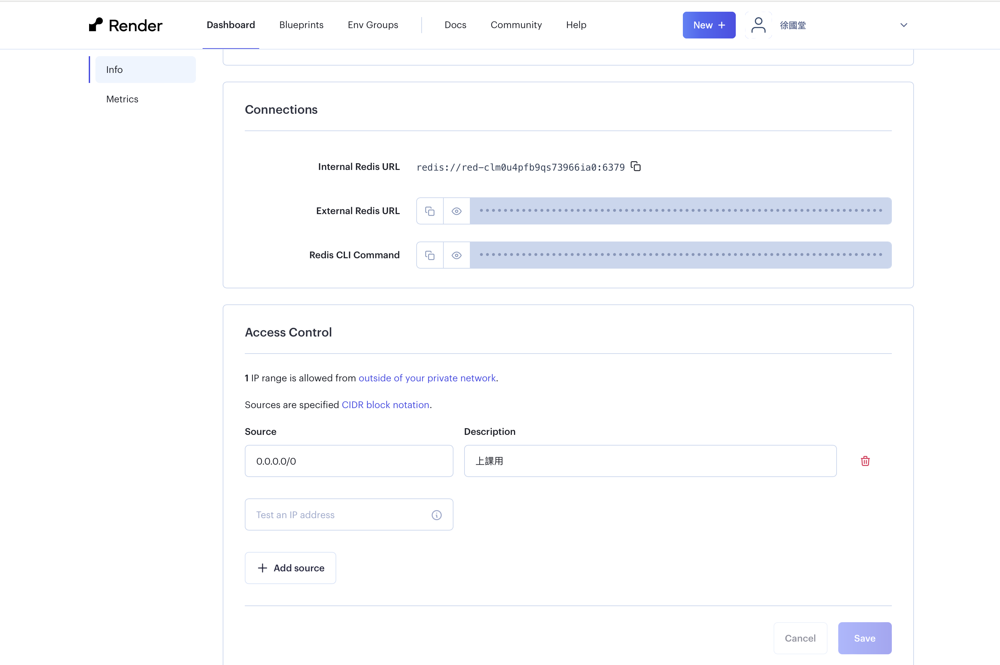
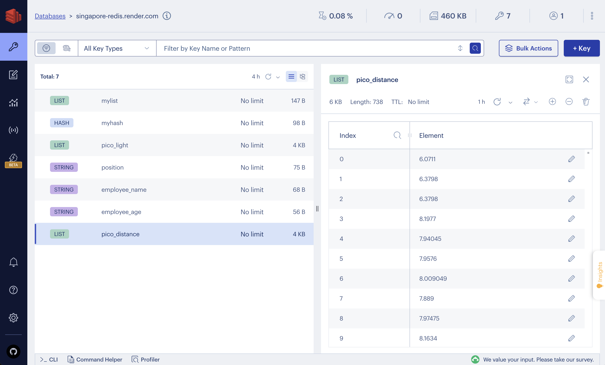
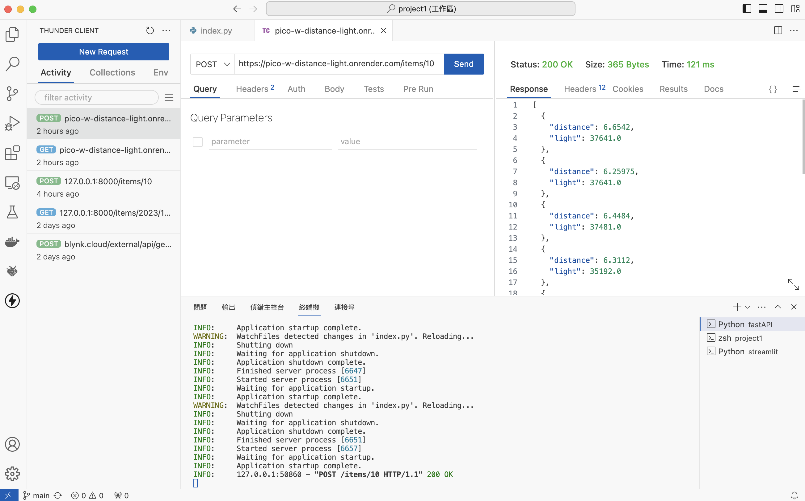
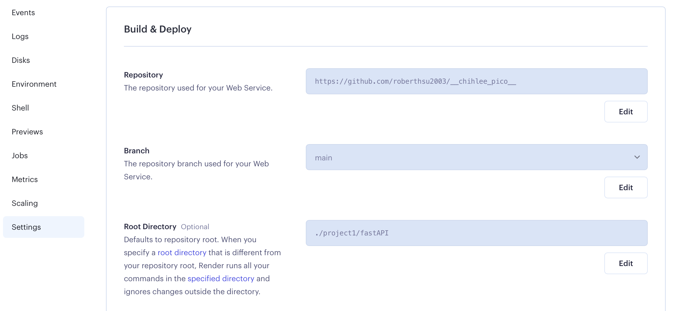
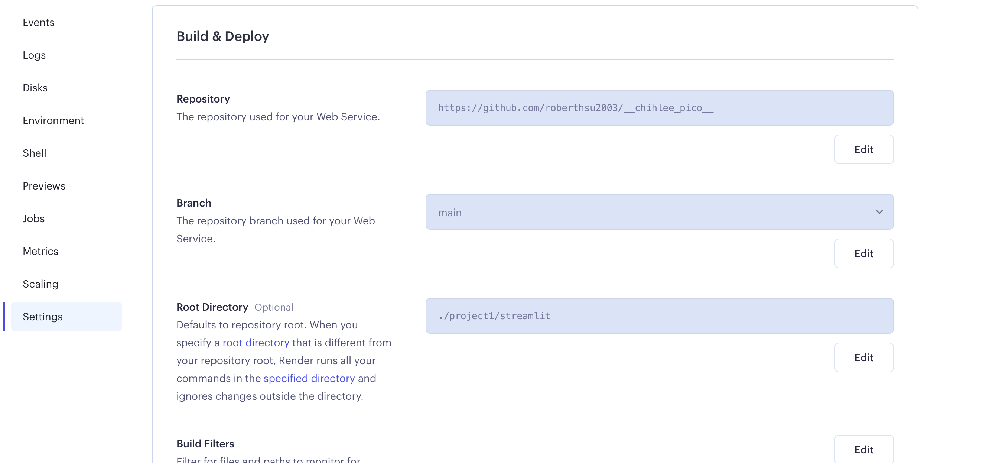
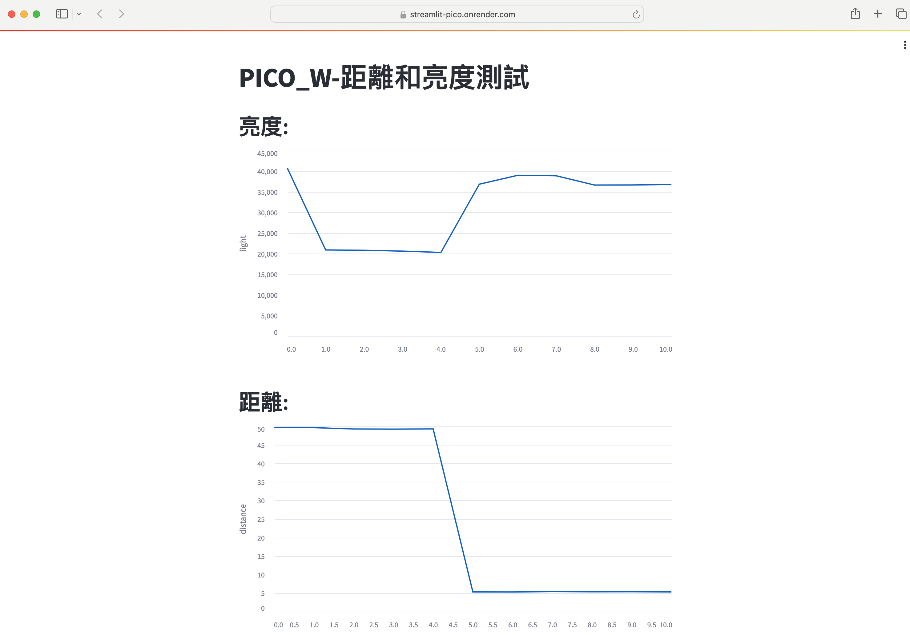

# 光敏電阻_超音波感測器

## 架構


## Pico_W

### 線路圖


##### main.py

```micro python
from tools import connect,reconnect
import urequests as requests
from machine import Pin,ADC,Timer,RTC
import utime
import ujson


adc_light = ADC(Pin(28))
trigger = Pin(16, Pin.OUT)
echo = Pin(17, Pin.IN)

def ultra()->float:      #建立一個函式
   utime.sleep_us(2)  #暫停兩微秒，確保上一個設定低電位已經完成
   trigger.high()
   utime.sleep_us(10)  #拉高電位後，等待10微秒後，立即設定為低電位
   trigger.low()    
   while echo.value() == 0:         #建立一個while迴圈檢查回波引腳是否值為0，紀錄當時時間
       signaloff = utime.ticks_us()   
   while echo.value() == 1:         #建立一個while迴圈檢查回波引腳是否值為1，紀錄當時時間
       signalon = utime.ticks_us()  
   timepassed = signalon - signaloff    #計算發送與接收時間差
   distance = (timepassed * 0.0343) / 2  #聲波行進時間 x 聲速(343.2 m/s，即每微秒0.0343公分)，來回距離再除以2  
   return distance
   
def lightSensor()->float:
    light_value = adc_light.read_u16()
    return light_value


   
def callback1(t:Timer):
    distance = ultra()
    light_value = lightSensor()
    rtc = RTC().datetime()
    date_str:str = f'{rtc[0]}-{rtc[1]}-{rtc[2]}-{rtc[4]}-{rtc[5]}-{rtc[6]}'
    
    #不要使用https呼叫,沒有傳出值
    #更新V0->distance
    #更新V1->light
    print(distance)
    print(light_value)
    print(date_str)
    
    #本機執行
    #url = f'http://10.170.1.42:8000/items/{date_str}/{distance}/{light_value}'
    
    #render端執行
    url = f'https://pico-w-distance-light.onrender.com/items/{date_str}/{distance}/{light_value}'
    
    
    try:        
        response = requests.get(url)        
    except:
        reconnect()
    else:
        print("server接收") #但要檢查status_code,是否回應成功        
        if response.status_code == 200:
            print("成功傳送,status_code==200")
        else:
            print("server回應有問題")
            print(f'status_code:{response.status_code}')
        response.close()
    
    
connect()
time1 = Timer()
time1.init(period=10000,callback=callback1)
```

##### tools.py

```
import network
import urequests as requests
import time
import rp2
from machine import WDT

rp2.country('TW')


#ssid = 'Robert_iPhone'
#password = '0926656000'

ssid = 'robertHome'
password = '0926656000'

wlan = network.WLAN(network.STA_IF)
wlan.active(True)
wlan.connect(ssid, password)
wlan.config(pm = 0xa11140)

def connect():  

    #等待連線或失敗
    #status=0,1,2正在連線
    #status=3連線成功
    #<1,>=3失敗的連線
    max_wait = 10    

    while max_wait > 0:
        status = wlan.status()
        if status < 0 or status >= 3:
            break
        max_wait -= 1
        print("等待連線")
        time.sleep(1)

    #處理錯誤
    if wlan.status() != 3:
        print('連線失敗,重新開機')
        #raise RuntimeError('連線失敗')
        wdt = WDT(timeout=2000)
        wdt.feed()
    else:
        print('連線成功')
        status = wlan.ifconfig()
        print(f'ip={status[0]}') 
        
        
def reconnect():
    if wlan.status() == 3: #還在連線,只是傳送的server無回應
        print(f"無法連線({wlan.status()})")
        return
    else:
        print("嘗試重新連線")
        wlan.disconnect()
        wlan.connect(ssid, password)
        connect()
```


## 建立雲端資料庫
- 建立render redis資料庫



- 安裝redis inside資料管理程式



---

## Open Web API(fastAPI)
- 利用 python-dotenv 載入環境變數
- 建立.env檔,放至環境變數
- 安裝vscode 擴充套件 thunder client,模擬get,post,update傳送(測試用)
- 上傳至render server

#### thunder client



#### 建立.evn檔案

- 注意,不要上傳.env
- **=** 2邊不要有空隔

```
redis=rediss://xxxxRedis的帳號和密碼:6379
```

#### requirements.txt

```
fastapi
uvicorn
redis
python-dotenv
```

#### .gitignore

```
__pycache__
.env
```

#### 建立fastAPI主程式

```python
from fastapi import FastAPI
from pydantic import BaseModel
import redis
from dotenv import load_dotenv


class Item(BaseModel):
    distance:float
    light:float

import os

load_dotenv() #載入.env的環境變數
app = FastAPI()
renderRedis = redis.Redis.from_url(os.environ.get('redis'))

@app.post("/items/")
async def update_item(item:Item):
    print(item)
    return {'status':'ok'}

@app.get("/items/{date}/{distance}/{light}")
async def update_item1(date:str,distance:float,light:float):
    #lpush是放在redis list的最前方
    renderRedis.lpush('pico_distance',distance)
    renderRedis.lpush('pico_light',light)
    
    return {"status":"ok"}

@app.post("/items/{lastNum}")
async def get_items(lastNum:int):
    #redis取出最前方資料(因為更新在最前方)
    distances = renderRedis.lrange('pico_distance',0,lastNum)
    light = renderRedis.lrange('pico_light',0,lastNum)
    
    #傳出的資料的索引是[9,8,7,6,5,4,3,2,1,0],所以要反轉資料
    #0是每次更新的最新資料,
    #list.reverse(),傳出None
    
    distances.reverse()
    light.reverse()


    #將byte string 轉換為 str
    distances_list = [item.decode('utf-8') for item in distances]
    light_list = [item.decode('utf-8') for item in light]

    #建立list_time:list[Item]
    list_item:list[Item] = []  
    for i in range(len(distances_list)):
        d = distances_list[i]
        l = light_list[i]
        #建立Pydantic實體
        item = Item(distance=float(d), light=float(l))        
        list_item.append(item)
    
    return list_item
```


#### 建立faseAPI server




---

## 建立Web Server(streamlit)

- 安裝自動reload套件 autorefresh的套件

```
$ pin install streamlit-autorefresh
```

#### requirements.txt

```
streamlit
requests
streamlit-autorefresh
```

#### .gitignore

```
__pycache__
```

#### index.py

```
import streamlit as st
from streamlit_autorefresh import st_autorefresh
import requests
import pandas

#自動reload頁面每2秒
st_autorefresh(interval=10000, limit=100, key="fizzbuzzcounter")

#測試url
#url = 'http://127.0.0.1:8000/items/10'
#正式url
url = 'https://pico-w-distance-light.onrender.com/items/10'
response = requests.post(url)
if response.ok:
    json_data = response.json()
    data_df = pandas.DataFrame(json_data)


st.title('PICO_W-距離和亮度測試')

st.header('亮度:')
st.line_chart(data_df,y='light')

st.header('距離:')
st.line_chart(data_df,y='distance')

```


#### 建立Web Server




#### 網頁頁面呈現




